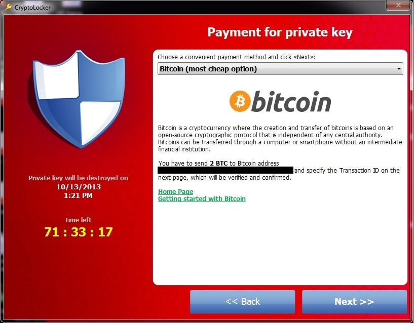
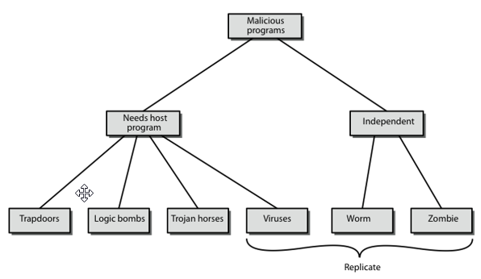

---
title:
- Malwares
author:
- Tuğberk Kocatekin, PhD
theme:
- Boadilla
colortheme:
- seahorse
date:
- Spring 2023
fontsize: 10pt
lang: EN
output:
 beamer_presentation:
    includes:
        in_header: header.tex
---

# Introduction

- There are different hats when we talk about security engineering.
- White Hat
  - A person who breaks into a computer network in order to test or evaluate its security systems.
- Gray Hat
  - Computer attacker or security expert whose ethical standards fall somewhere between good and bad.
- Black Hat
  - A person who breaks into a computer network with malicious or criminal intent.

# Key Terms

- Malware
  - Short for malicious software.
  - Code or software designed to damage, disrupt, etc.
- Viruses, worms and trojans are malwares. These can infect systems by being bundled with other programs or can be attacked as **macros** to files.

# Trojan

- It is a piece of software. Users are tricked into running that program. When the program is run, it can do multiple things!
  - Irritate the user by controlling the mouse, cd-rom, etc.
  - Damage the host by dleeting files, stealing data etc.
- They are also used as **backdoors** to give other user's access. 
  - Trojans **do not replicate** themselves.
- They work by **client - server** architecture. The attacker creates a software pair (client.exe and server.exe). 
  - Server.exe is sent to the victim. When the victim runs the program, _server.exe_ starts listening to a pre-defined port. 
  - Client.exe connects to computer by using the IP address and enters through the open port.

# Viruses

- Inserts a copy of itself into a program.
- Spreads from one computer to another, leaving _infections_ as it travels.
- Almost all of them are **attached** to an **executable** file. It may stay in the system, but unless someone runs the program with the virus, it will not be active.
- When a program is infected, it still does what it is supposed to do, so it is hard to understand by just looking at the program.
  - However, some viruses can intentionally break down the host program.
  - When you run it, virus runs and the program runs.
- They can easily spread in networks.
- Computers can get infected from _file sharing_, _USB disks_ or _email attachments_.

# Viruses

- Viruses duplicate themselves, but it is possible that they can change themselves a little bit so that it is hard to catch them. These are called _mutating viruses_.
- Viruses cannot spread by themselves. We call them **worms**.
- Someone needs to send an infected file or put it in a network for people to download.
- It is hard to find viruses in Unix operating systems because of access control (user permission). 
  - In Unix, you are not **root** at all times. If there is such program, you need to be _super user_. However in Windows, we are usually in Administrator mode, which makes programs to do anything they want.
- In order to escape detection, sometimes they encrypt themselves with different keys in every infection.

# Viruses

- It is not that hard to write a simple virus. Remember, viruses run on executable files.
- So, in a directory you can create a file which opens those files, put their own code in and stop. Now, every executable file has the ability to do the same thing! 

# Worms

- Worms can replicate themselves and cause same type of damages as viruses. Computer can be infected by worms by email, remote execution or remote login.
- They do not **rely** on a host software.
  - Virus does.
- To spread, they can exploit a vulnerability or just trick people into running those programs. 
  - For example, sometimes they can disguise themselves as a system process so that you think you must run them, or at least if you see them running, you don't kill them.
- The damage caused by a virus is to the local machine, but since the _worm_ can duplicate **itself**, it can harm a network and consume network bandwidth.
- Antivirus programs are supposed to catch worms too.

# Worms

- Still, when you don't have root access, the amount of damage a worm can do is limited. However, even if it cannot harm the local machine, a propagating worm can consume network bandwidth. 
- It is safe to say that any worm can create big problems for a network.
- There are several ways a worm can enter your computer. One of the important ones is using remote shell (ssh). This command lets you run a program in a remote computer.
- So, worms have built-in attackers which try known usernames and passwords on a port in an IP range. Imagine that every worm is doing the same thing.
  - So, when a worm attacks you, it is possible that it is attacking from a zombie.

# Case Study (Morris Worm)

- This worm was the first significant worm that effectively shut down the Internet for several days in 1988. Created by Robert Morris. It uses several security holes.
- It uses a _bug_ in **sendmail** program which is used as a mail transfer agent. 
- A _bug_ in the **finger** program. There was a buffer overflow problem in this program.
  - A program allocates a memory but if it doesn't check whether the data fits or not in this memory space; what you end up with is that program can _overflow_ and write to places it shouldn't write. 
- It used a remote shell program called **rsh** to enter those machines by guessing passwords (similar to dictionary attack).
- For further information: [click here](https://spaf.cerias.purdue.edu/tech-reps/823.pdf)

# Backdoor / Trapdoor

- These are specifically designed instructions to bypass the regular authentication methods. For example, if you are building a system, you can give yourself access in the source code and no one would know!
- Generally, developers put those in development but forget to remove them. One should be very careful about it! 
- Sometimes people leave these for maintenance purposes, thinking that no one would try or learn about them. 
- They can also leave them intentionally for malicious purposes!

# Botnet

- Bot is short for _robot_. Botnet is short for _bot network_. Bots are programs which are automated to work with other network services.
- Malicious bots are _self-propagating_ malware which infects the host and connect back to a central server.
  - That central server is called C&C: Command and Control
- C&C is a center for an entire network of compromised devices.
- These are generally used to attack web services with DDoS attacks in order to make them unavailable.
  - We will talk about DDoS attacks.
- Bots are also used to create **backdoors** for worms and viruses. You may have a bot in your computer and not even know because they are designed smartly.

# Botnet

- Bots do what the _bot master_ tells them to. It is not similar to a worm or virus, they are pre-programmed. Bots can do anything.
- They can infect **millions** of computers.
  - Check Mirai and Rustock.
- When a collection of bots are working together for the same master, they are called **botnet**.

# Botnet

- We use commercial devices in our homes. These devices can usually connect to the Internet. We call these devices IoT: Internet of things.
- Since standardization is not good in IoT, there are a lot of vendors creating a lot of devices and they almost _all_ **lack** simple security measures.
- That is why it is very easy to attack these devices and compromise them.

## Example

- You have modems in your house. All these modems have a default username and password, so that you can connect to them to adjust settings via 127.0.0.1.
- If you don't change that password, I could easily get into that modem and change your settings, breaking your connection.
- This is the same for commercial devices. Let's say you have bought a camera and you can connect to it in browser. If you don't change your default username and password, someone can easily connect and see whether you are at home or not!

# Ransomware

- These are types of malware which limits users from accessing their system. The most well known is **Cryptolocker**.
- They usually encrypt everything in the computer so that the user cannot reach them. 
  - If you want to reach your files, you need to **pay a ransom** to attackers, usually via cryptocurrencies.
- These can be downloaded or come with a malware, worm, etc.
- Even if you want the program and delete them, your files are encrypted. And it is encrypted with **strong** encryption. AES + RSA!
- That is why **backups** are very important.
  - We will talk about them later!

# Cryptolocker

{ width=70% }

# Ransomware

- Of course there are some problems with Cryptolocker. You must need to trust the attackers, which are by nature are not to be trusted. 
  
- It is possible that you pay the random but they can ask for **more** money. There is no guarantee. 
  - A good case for a **smart contract**. If it were, the system would automatically decrypt files.

# Rootkits

- Rootkits allow the attacker to administratively control a computer. They have two primary goals:
  - remote command/control 
  - software eavesdropping
- Often uses an unpatched exploit to get into the system.
- Usually leaves a **backdoor** for the attacker to be able to get back into the system later. You may delete the rootkit, but the backdoor would remain.
- It has **stealth** capabilities and can hide itself. They can even modify the **kernel** so that security applications cannot find it.

# Keyloggers

- Keyboard is the main device we use to communicate with the computer alongside with mouse.
- These programs capture and logs every key press we do.
  - These includes the usernames and passwords!
- It is usually sent over the Internet to the attackers, but it is also possible that they can put a keylogger in a shared machine.
  - So be very careful when you are using a shared machine. E.g., if you are going to a copy center to print stuff, create a temporary and unimportant email address for it.
  - Also, using 2FA will help.
- These programs can also be used to _spy_ on people.

# Security

- Do not enable **macros**. Remember, a lot of them comes with Office files. PDF files also have macros! 
  - Of course, Microsoft is working towards better systems so that people are not infected. However, this is still the case.
- Office software are not free. Therefore, in order for people to be able to open these files, there are software called Viewers. You can run these files with viewers so that macros do not work.
- We should also bookmark some important websites and use those links to enter them. The reason is, it is possible that we can do typos! Attackers plan for this. 
  - denizbnak.com.tr
- We should download software not from USB disks or regular websites but online repositories. In Windows, there is _winget_ and in Linux (Ubuntu) there is _apt-get_. These are similar to App Store and Play Store. They would be better security wise.
- We should not run our computers in administator mode. You can adjust permissions in Windows computers too.

# Security

- These malwares are very important and we should be very cautious against them. They can clog up our machine, steal information and turn our machine into a zombie for attacking other websites or doing illegal stuff.
- Many people are using Windows machines for daily tasks such as gaming, work, etc. Usually, since we are now using web applications for almost everything, using a Windows machine for purposes other than gaming is not very smart. Linux operating systems can do almost everything we do daily, and we can use online / offline services for Office applications, such as Office 365, Google Docs and Libre/Openoffice.
- However, your computing habits are very important. Regardless of your operating system, you should not visit or trust HTTP websites, download attachments from emails, etc.
  
## Antivirus software

- Antivirus softwares are good but remember that if you were to create a virus or worm, you would probably test that against the antivirus software! So, in short; antivirus software do not make it okay for you to have bad computer habits.
  - Actually that is why using a closed OS like Android / IOS is better for elderly or those with bad computing habits/skills.

# Security

- We can employ another approach to security. Even if a malware enters our computer, what if there is nothing to be stolen? It is possible!
- If we can encrypt our files, a malware can do nothing! It is very easy to encrypt files. We have shown this in previous lectures.
  - One can use GPG!
- There are also password managers and even text-based versions of them such as `pass`.

# Sandbox

- You can run programs in a separate environment such as virtual machine.
- There are Linux distributions specialized in these kind of solutions.

# Summary
{ width=70% }