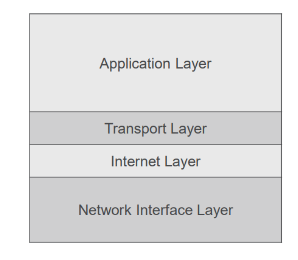
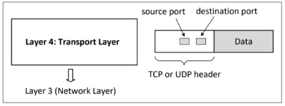
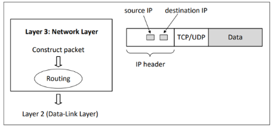
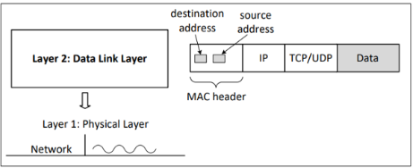
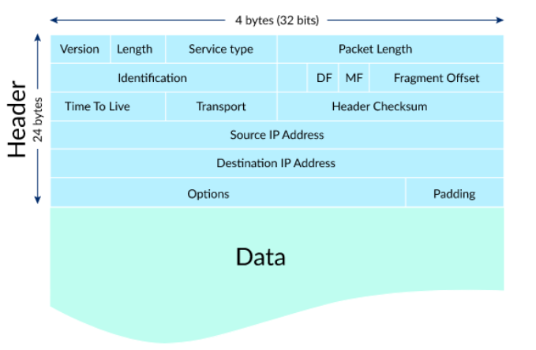
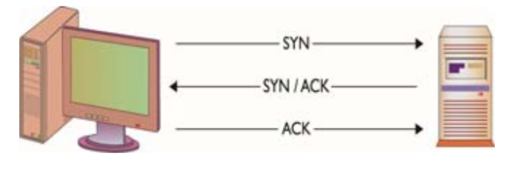

<!-- _class: title -->

# Network Recap & Some Network Attacks

Tugberk Kocatekin
T.C. Istanbul Arel University
Spring 2023

---

# TCP/IP

* Networking is the connection of two or more computers in order to share information and resources.
* Imagine there are two computers connected to each other by a single wire. This is enough to create a network. 
* Remember the TCP/IP stack?


---

# TCP/IP



---


# TCP/IP

**Network Layer**
  * Takes a message and encapsulates it within a packet for transmission.
   
**Internet Layer**
  * Responsible for routing packets from one device to another.


**Transport Layer**

 * Ensures the message is delivered. That means it ensures that the transmission is successful. It uses _packet numbering_ for it. It also manages **congestion** in the network.
  
**Application Layer**
  * User services that provide abstract functionality (FTP, HTTP, etc)

---

# Layer 4 - Transport Layer

* Application Layer has the data and sends it down to Transport Layer. Here, depending on the communication protocol, Transport Layer adds a **header** to the data.
* It sends it to **network layer** after adding it.
  




---

# Layer 3 - Network Layer

* Network layer knows the **sender** and **receiver** IP address and adds that information to the package as the **IP Header**.
* Sends it to **Data Link Layer**.




---

# Layer 2 - Data Link (MAC) Layer

* At this point, we have the **data**, **header** and **IP Header**. We are only missing the **MAC header** which consists of `destination address` and `source address`.
* After adding that, the package is given to the Physical layer and sent to the other side.



---

# Protocols

* In networks, there are protocols which are **rules** for clients and servers to follow such as:
  * Packet format
  * Packet ordering and timing
* There are protocol standards, **RFC** is one of them.
  * Request for Comments
* Some protocol examples;
  * TCP, UDP, ARP, HTTP, etc.

---

# IP Address

* IP packet is also called a **datagram**.
* It has two main sections:
  * Header
  * Data section (payload)
* Header describes the packets.
* There are Private IP addresses which we use in our Local Area and Public IP address which is given to us by DHCP. (You can manually give IP address too.)
  * When you connect to the Internet, everyone in the local area have the same Public IP because they are using a single gateway to the Internet.
* Private are usually: 192.168.x.x and 10.0.x.x

---

# Packets

* When you want to send information through the Internet, you use packets and send them by one or more packets.
* Size of packets are limited, that is why sometimes we divide a packet into multiple packets.
    * And sometimes a packet can be lost. 



---


# Networking

* Let's say there are two houses **A** and **B**. 
  * A wants to send a message. Since there are only two houses, it cannot send to anyone but B. 
  * So, if A gives us a message, we know that the recipient is B.
* However, if there is another house **C**, now we need to know whether the recipient is B or C.
  * A must write the name of the **destination**.

---

# UDP

* User Datagram Protocol
* Connectionless protocol   
  * It means that this protocol does not guarantee that your packets are going to be sent to/received by the **destination**.
* Unreliable
  * If a packet is lost, there is no re-transmission. So, no guarantee.
* Still, it is good for media streaming, gaming, VoIP, etc.
  * Why?


---

# TCP

* Transmission Communication Protocol
* Connection oriented
  * It means that before sending data from _source_ to _destination_, a connection is created between two parties.
* Reliable
  * Ensures that our packets are sent to the destination **in the order** we send them. Uses _sequence numbers_ to do this.
  * Does re-transmission if the packets are lost.
  * Gives you information if data is received by the destination.
* It is good for web, SSH, etc. where you need **reliable** communication.

---

# 3-way handshake

* TCP is connection oriented and the connection is established by using this handshake method.
  


---

# 3-way handshake

**SYN (Synchronize)**
* Source sends a SYN packet to the destination. SYN packet has the **port** information that the source wants to connect and gives the initial packet sequence.
  * Remember that reliability is satisfied by using seq. numbers.
  
**SYN/ACK**
* Destination sends back SYN/ACK which means _I received your request_ and also gives the destination's initial seq. number.

**ACK**
* Source sends back an ACK (_acknowledge_) to establish the connection.

---

# TCP vs UDP

* **TCP**
  * Bob: I want to communicate with Alice.(SYN)
  * Alice: I am Alice. (SYN/ACK)
  * Bob: Hi Alice, I am Bob. (ACK)

* TCP is used where reliability is important.
* UDP is generally used for real-time stuff.


---

# MAC Address

* MAC: Media Access Control
  * A unique identifier for every network adapter. 
  * Also known as hardware address.
  * This is different for every adapter in the world.
    * However, we can spoof it.

* It is created by the _vendor_ and wired into the network card. The form is in **AA:BB:CC:DD:EE:FF**. 
* For example, our computers has multiple MAC address (at least 2). One is for WiFi and the other is for Ethernet. You can learn these addresses by typing `ipconfig /all` in Windows and `ifconfig -a` in Linux and Mac.
  * However, it is possible that you need to download some packages to see them.

---

# Ports

* IP address is the **address** of the computer and ports are **doors**. They go together. Without specifying the port number, you cannot send anything to an IP address. **Why?**
  * Because they would not know how to enter the house!
* When we are connecting to a website, we are actually using the Port number 80.
  * There are 65536 ports.
  * We can also reach to other ports by using browsers. It is possible that the webserver is listening to another port.
    * `https://127.0.0.1:3000`
* Some ports are well known such as 80 (HTTP), 20-21 (FTP), etc.

---


# DoS

* Attacker tries to consume the target's resources so that it cannot provide any service anymore.
* Denial of Service (DoS)
  * A computer floods a server with packets.
  * By flooding the server (TCP or UDP) it overloads the bandwidth.
  * Server becomes unreachable.
---

# DDoS

* Distributed Denial of Service
  * Instead of **a** computer, now there are several computers sending packets to overwhelm the server.
  * _Mirai botnet_ attacked to a **CDN server**. Since these are used for media, many websites could not work correctly.
* Both these attacks aims to make the server unavailable for **overwhelming** its traffic.
* These can even be done by `ping` commands!

---

# DDoS and Botnets

* Botnets are usually used for DDoS. A program in your computer or **device** can be attacking websites.
  * Any device connected to a internet can be a _zombie_.
  * Those devices are used as **soldiers** and can be controlled from a remote place.
    * Command & Control Servers
* Also, it is possible that attackers are sending you a DDoS attack while trying another attack!

---

# DDoS

* As we know, TCP is _connection oriented_.
  * In order to send something, you need to establish a connection.
    * 3-way Handshake
    * SYN Flood attack can make use of this.
---

# SYN Flood attack

* A computer sends request with IP address of some other computer (let's say X) to the server. 
* V sends a SYN/ACK back to X.
* Since X has nothing to do with the server, it discards SYN/ACK and leaves a half open connection at the server.
* When attacker does this with multiple computers and multiple IP addresses, there will be many open connections and this is going to exhaust resources at the Server.
  * Which leads to DoS.

---

# DDoS

* There are two main types: Direct and Reflector
* Direct DDoS is previously mentioned.
* Reflector DDoS
  * This is more damaging and protects the attacker's identity better.

---

# Homework

* Please read the homework in UZEM.
  * What is Reflector DDoS?
  * What can we do to secure ourselves from DDoS?

---

# UDP Flood Attack

* When you send an UDP packet to a server for a specific port, two things happen:
  * Server checks if there is any program listening to that port
  * Responds you with ICMP(ping) if there is no such program.
* Therefore, for every request the server needs to go through each port and check whether a program is listening to it.
* Attackers also sends these requests by changing the IP address in the header so that the responds are not coming back to itself and exhaust attackers network.

---

# DNS & DNS Flood Attackk

* DNS (Domain Name System)
  * These are _phonebooks_ of the Internet. When you try to connect to a website by writing the name, it first checks the DNS server and gets the true name (IP address) of the computer.
* DNS is important and if you can attack DNS infrastructure, many people will be unable to use the Internet.
* By using high bandwidth connections of IoT devices such as IP cameras, DVR boxes etc. they can overwhelm the DNS servers of major providers. (Uses UDP)
  * When the number of requests are too much, DNS is spending a lot of time answering those and cannot answer our requests.
  * Usually done by _botnets_ which took control of such IoT devices.

---

# IP Spoofing

* When we are sending a packet, it has source and destination IP address written in the header.
* Here, we change the source IP address to some other address.
  * It is similar to sending a message with a **wrong** return IP address. 
* When you attack a server with the same IP address, they are going to block you at some point.
  * You change the source IP address frequently so that they cannot block you.

---

# Man in the Middle (MITM) Attacks

* A general term used to identify attacks when a network trafic is rerouted.
* Let's say A and B are communicating with each other and A is sending a message to B.
  * You (C), get in the middle and get all packets. You read them all, and relay that package to B.
  * No one knows you read the messages.
* It is a problem because now it's possible that you can relay **different** messages to B without breaking the connection.
* In networks, this can be done by using ARP spoofing.

---

# ARP Spoofing
* Also called ARP cache poisoning, ARP poisoning etc.
* ARP is Address Resolution Protocol. It is used to resolve _Internet layer addresses_ into _link layer_ addresses.
* _Data link layer_ uses MAC addresses to transmit data. Therefore, when you send a message from one host to another, a system must find the MAC address of the destination.
* First, the host looks at its **ARP table** if there is a MAC address for that IP address.
  * If not, it sends a _broadcast packet_ to the network which is called an **ARP request**.
* Every device has an ARP table.

---

# ARP Spoofing cont.

* Destination machine with the IP in the ARP request responsd with an _ARP Reply_ which contains the MAC address for that IP address.
* When you learn this information, you write it into your _ARP table_. 
* Be careful that this information is _broadcasted_. Computers which are not the host don't even reply to it.
  * However, the one who is that device responds.
* Instead of that device, we are going to respond to that request, stating that we are that machine (where we are not).

---

# ARP Spoofing cont.

* Now, the computer is going to update the ARP table and now is going to send every packet to us, instead of the original destination.
* Since we know about the destination, now we can read that data and relay that data.
* This is a well known attack, especially in big networks. When the security was lacking in the previous years, this attack could be used to steal user credentials very easily.
  * If the packets are not encrypted, that means they can be read!
    * However, if they are encrypted, even if you do this attack you will be unable to read messages.


---

# ARP defence

* **VPN** solves this problem because it is encrypted.
* **Using static ARP**: If you define a static ARP entry for an IP address, it is not going to send a request and will stop listening responses.
* There are also software to prevent ARP spoofing.


---

# Hardware Firewalls

* When we are communicating via Internet, every packet goes through the Router. 
  * Therefore it is also the first line of defence.
* This device assigns a private IP address to every computer in the local area network and uses _network address translation_ to map these **private** addresses to a single public address.
* NAT also acts as a firewall by hiding the true addresses of attached equipment and controls which traffic reaches to each computer.
* Firewall restricts data transmission through most TCP and UDP ports. But it can be adjusted.

---

# Software Firewalls

* Hardware firewalls protect the whole LAN, where software firewalls only protect those computers which it is installed to.
* They not only limit the incoming traffic but can also control the outgoing traffic.
* When a software in your computer is trying to send something through a port, it can block it and give you notification about the software.
* It is an important line of defence.
* You can change the settings of the firewall so that it can let software communicate through certain ports.

---

# Packet Filter

* Inspects packets transferred between computers. 
* Uses _control policies_ to decide which data packets should be granted/denied request.
* Uses an _access control list (ACL)_ containing _authorized_ or _blocked_ port numbers, IP addresses etc.
  * Even if you download a _keylogger_ or _trojans_ if the firewall works correctly, they are not going to be able to send information to the outside world.

---

# Proxy Server

* Intermediary which acts as gateway between the user device and Internet. 
* Set up via web filters or firewalls.
* It protects the user by hiding or masking the identity. 
* It can aso be used as a repository to keep user's internet activity and website history.
  * It can get websites in cache to provide faster access.
* Sometimes companies use it to _block_ connection to certain websites too.
  * And sometimes it is used to overcome blocking.
  * Opera VPN is essentially a proxy server.

--- 

# IDS (Intrusion Detection Systems)

* These are devices or software application which monitors a network or systems for malicious activity.

* Firewalls allows traffic only from those who we let in.
  * What happens if they attack us?
* For that we use IDS. They monitor data and behavior, and report when they identify attacks.
* There are different kinds of IDS:
  * Signature-based, host-based, anomaly-based and network-based.

---

# Signature-based IDS

* Uses known pattern matching to signify attack. 
  * Byte sequences or instruction sequences used by malware. 
* It is widely available and fairly fast.
* Easy to implement and update.
  * Cannot detect attacks if it doesn't know the signature/pattern.

---

# Anomaly-based IDS

* Introduced to detect _unknown_ attacks. There are a lot of malware being created and it is hard to know all - people don't update that much. 
* Uses statistical model or machine learning engine to characterize normal usage behaviors.
  * If there is any difference from normal usage, it is seen as potential intrusions.
  * You train a model so that it can understand what _trustworthy activity_ is. 
* This can detect new attemps on unknown vulnerabilities.
  * Generally slow and more resource intensive compared to signature-based.
  * Greater complexity.
  * Higher percentage of _false positives_.

---

# Network-based IDS

* Examine raw packets in the network passively and triggers alerts.
* Easy to deploy and difficult to evade.
 

---

# Host-based ISD

* Runs on single host. 
* Can analyze logs, file integrity and directories.
* More accurate compared to NIDS.
  * Deployment is expensive
  * Doesn't work when host get compromised.

---

# IDS Placement

* Depends on the needs of the network.
* Behind the firewall
  * Common practice. Provides IDS with high visibility of traffic entering the network. 
* Beyond the firewall
  * To defend against common attacks such as _port scans_ and _nmap_. 
  * Signature-based.
  * Useful because rather than showing _actual_ breaches it will show _attempted_ breaches. 
  * Also decrease the amount of time taken to discover successful attacks.
* Within a firewall
  * To integrate sophisticated attacks. 
* Within the actual network to reveal attacks or suspicious activity within the network. 

---

# Summary

* There are security vulnerabilities in TCP/IP because it assumes a lot of trust.
* There are several attacks on different layers:
  * IP attacks, ICMP attacks, Routing attacks, TCP attacks, App Layer attacks.
* IP addresses are filled by originating host. This makes IP spoofing possible.


---

# Application

* `nc` netcat.
* Let's open up two shells. In one, we are going to listen to port 84 and from the other we are going to connect to it.
  * `nc -l 84` (root is needed for listening a port)
  * `nc localhost 84`
* We created a very simple chat between two computers.
  * You can also use this to send files.
*Using `nc` like this creates a TCP connection. If you use `-u` flag, it becomes a UDP connection.

---

# Sending a file

* In Server A, `nc -l -p 84 > log.txt` 
* In B, `cat hello.txt | nc -w 5 localhost 84`
* Here, `-w` is for timeout. Otherwise it will stay on. 
  * Now, in Server A we can read `log.txt` and will see the result of hello.txt
* Here, the contents are not encrypted so be careful.
* However, we can encrypt the file beforehand with `gpg` and send that file instead.
  * Or we can use `openssl` and use stdin.

---

# Another example

* `sudo nc -l -p 94 | cat -`
* Client will send `echo "hello there" | nc -w 5 localhost 84`
  * It will output immediately.

---

# Python Example

* We can so something similar by using Python programming language.
* There will be two examples here. One for `server` and the other for `client`.
```python
#rec.py
#this is for the listening server
import socket

IP = "0.0.0.0"
PORT = 9090

sock  = socket.socket(socket.AF_INET, socket.SOCK_DGRAM)
sock.bind((IP, PORT))

while True:
    data, (ip, port) = sock.recvfrom(1024)
    print("Sender: {} and Port: {}".format(ip, port))
    print("Message: {}".format(data))
```

---
* We are listening with the other one. We can write several software as below to send information from other computers! 

```Python
#Sender - send.py
import socket

IP = "127.0.0.1"
PORT = 9090
data = b"hello world"

sock = socket.socket(socket.AF_INET, socket.SOCK_DGRAM)
sock.sendto(data, (IP, PORT))
```

