<!-- _class: title -->
# DES - AES

---

# Block Ciphers

Block cipher is an algorithm that encrypts blocks of a **fixed** length.
- $C=E(k,P)$ and $P=D(k,C)$

- The size of the input and the output are the same.
- Keyspace is the set of all possible keys.
- A _symmetric encryption_ scheme.
  - Remember that the key used for encryption and decryption is the same.

---

# Block ciphers

- DES(Data Encryption Standard)
  - Before AES, this was the encryption standard. It is a block cipher and in order to understand block ciphers, we will go and understand how DES works.
- Compared to asymmetric cryptography (RSA) symmetric ciphers are generally more complex and harder to understand.
- They are applicable to a broader range of applications compared to _stream_ ciphers.

---

# Confusion and diffusion

Claude Shannon stated that there are **two** primitive operations with which strong encryption algorithms can be built:
- **Confusion**: Encryption operation where the relationship between key and ciphertext is obscured. The common element for achieving confusion is **substitution**.
  - The relationship between the encryption key and the ciphertext must be as complex as possible.
- **Diffusion**: Encryption operation where the influence of one plaintext symbol is spread over many ciphertext symbols with the goal of hiding statistical properties of the plaintext. An example is **bit permutation**.
  - A change in plaintext bit must propagate out to as many ciphertext bits as possible.

---

# Confusion and diffusion

- Some ciphers only do one of these.
  - Shift cipher only perform confusion. Therefore, we cannot say that they are **secure**. 
  - Enigma is also an example to it and it was broken.
- We combine _confusion_ and _diffusion_ to get a strong cipher. The idea of concatenating several encryption operations are proposed by _Shannon_ and these are known as **product ciphers**.
- Today, almost all block ciphers are product ciphers because they consist of _rounds_ which are applied _repeatedly_ to data.
- These are the two cornerstones of block cipher design.

---

# Confusion and diffusion

Here, there are $N$ rounds. This is an $N$ round product cipher. Every round performs a confusion and diffusion operation.
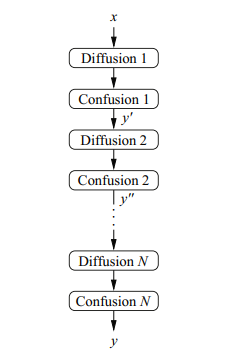

---

# Confusion and diffusion

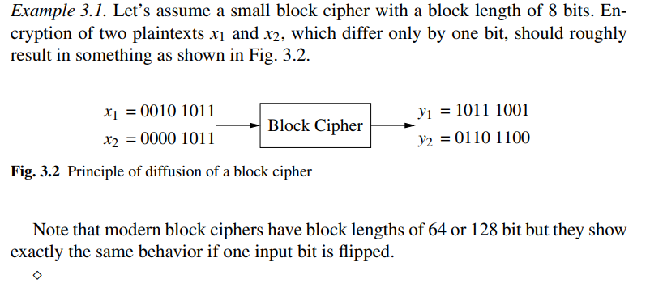

As one can see, the result is very different. This is possible because of **diffusion**.

---

# DES

* USA tried to come up with a single secure cryptographic algorithm to use for variety of applications.
  * Cryptographers from IBM submitted an algorithm based on _Lucifer_ cipher. 
  * It is a family of ciphers developed by _Horst Feistel_.
  * Luciger encrypts blocks of 64 bits using a key size of 128 bits.
* DES uses a key size of 56 bits.
* It was used until AES became a standard.

---

# DES

* $P$ is 64bits.
* Encryption key $k$ is 56 bits.
* 16 rounds.
  * Every round, a **different** key $k_i$ is used, which is derived from the original key $k$.
* It uses _Feistel network_. Based on _Lucifer_.
* Lucifer used 128bit key space, but DES 56.
  * The reason is the memory and processing constrains imposed by a _single-chip_ implementation of the algorithm for DES.
* It is broken in 1999. After that, organizations used **Triple DES**; three consecutive applications of DES. 

---

# Feistel network, cipher, structure

- Named after _Horst Feistel_ from IBM. The first application is the _Lucifer_ cipher.
- A cryptographic system based on Feistel structure uses the same algorithm for _encryption_ and _decryption_.
- Consists of multiple rounds with each round consisting of a **substitution** and **permutation** step.
- It is very much used in block ciphers such as DES, Blowfish, KASUMI.
- Let's draw it and talk about it more.

---

# DES

* What is specific to DES is the function $F$.
  * That function is done by using S-boxes and P-boxes.
* DES is a closed box and we will learn about it layer by layer.
  * First, an input $P$ (64 bits) and a key $k$ (64 bits) enters and gives out a $C$ (64 bits).
  * There are 16 rounds (submodules) working sequentially.
  * Every submodule gets an _input_ and a _round key_ $k_i$.
    * The input of a submodule is the output of the previous submodule.
  * Every submodule works with $48$ bits.
* Here are our unknowns: How do we get $k_i$? How do we get from 64bit input to 48bits? What are S and P boxes do?
  * We will answer these questions!

---

# DES

Remember that DES is a feistel structure. 

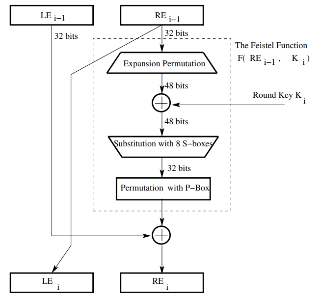

---

# E-step

* Here, we put 32 bits into this **Expension Permutation** to get 48 bits! 
  * We expand our 32 bits. We will see how this works in detail!
* After that, we XOR this with the _round key_ $k_i$. (This is called **key mixing**)
  * We will see how to generate round keys!

---

# S-box

* After _key mixing_, we have 48 bits. We divide this into 8 x 6bit words. 
* Each word enters a different S-box. (There are 8 S-boxes, one for each word)
  * Each S-box gets a 6-bit input and gives out a **4-bit** output.
* Therefore, after this, we have 32 bits again.
* Every S-box is known and it is not a secret.

---

# P-box

* After that, we put that 48 bits into a P-box and shuffle that again to get a new 48-bit string. 
* That will end our first round. That value is going to be XORed with the left hand and will give us the **right** hand for the **next** round.

---

# E-step 

- 64 bits are divided into 2 x 32 bits.
- The right hand side is entered to an _Expansion Permutation_. This will give out a 48-bit output from a 32bit input by following these procedures:
  - Divide 32 bits into 8 x 4-bit words
  - Attach an additional bit on the **left** to each word that is the **last** bit of the **previous** word.
  - Attach an additional bit on the **right** to each word that is the **beginning** bit of the **next** word.

---

# E-step

- At this point, we have 8, 6-bit words which in total comes to 48 bits.
- The output of each E-step is XORed with the _round key_ $k_i$ and that is called **key mixing**.
  - That means that our key should be 48bits too! We will see how to do it later!

---

# S-box

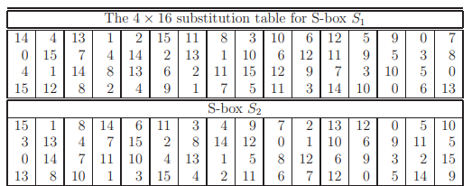

* These boxes are **known**. We know all 8 boxes for DES. These are the examples for $S_1$ and $S_2$.

---

# Example

What is the output of $101111$ when it enters S-box $S_1$?

---

# P-box

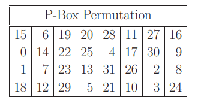
* Each row for a **byte**. 
  * Remember, we have 32 bits at this point = 4 x 8bits.

---

# Generating round keys

The $key$ is 56 bits but it is represented with 8 bytes.
- How is this possible? Because the _last bit_ of every byte is a parity bit.
- First, we apply a _permutation_ to our key. This permutation will shuffle our key and give us a 56 bit output. (Remember, it was 64 bits originally)
- After that, we divide the 56 bits into two halves: 28 and 28.
- We are going to shift these halves circularly 1 or 2 bytes, depending on the round number. (_We have a table for that_)
- We group these halves after shifting operation and put them in a new P-box, which will turn our 56 bits to 48 bits.
- That 48 bit is our round key $k_i$. And the two halves are going to be the starting point for the next round key $k_{i+1}$.

---
# Generating round keys

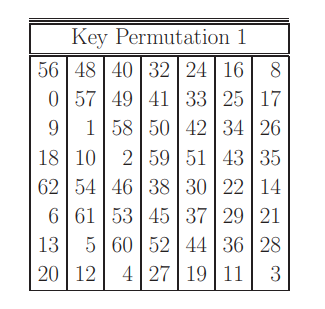 

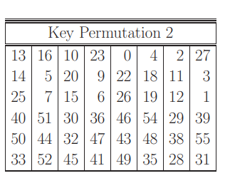

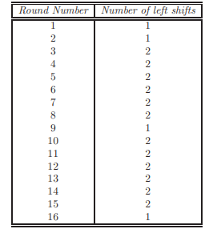

---

# Example

Let's create some _round keys_ $k_i$ from the key 
$k$ = 1010100010000110100011001110011111101000111111001001011010010001

---

# Answer

1. First, we use the first P-box and shuffle the input $k$.
2. Secondly, we divide it into two halves $L$ and $R$.
3. We apply circular shifts to it by checking the given table above. (Shift 1 to left)
4. At this point, these values are going to be the _starting point_ for the next round. We have a next round because at this point we are going to find $k_1$. How are we going to find $k_2$? We need another round! So, now these values are inputs for the next round to find $k_2$.
5. However, we did not find $k_1$ yet. For that, we will use the second P-box. So these values are going to enter the second P-box and will give us $k_1$.
6. We join these halves together. It is not $56$ bits. We want $k_i$ to be $48$ bits. So, this P-box will turn our 56 to 48.
7. We use the second P-box and get $48$ bit output! That is our $k_1$.

---

# AES

At first, there was DES. However, there are some problems with the DES.
- The key size is too small. It is 56 bits.
- As a solution, people started using **Triple DES** which uses 3 different keys and 3 DES operations. 
  - Now it is secure, but _slow_.
- DES means _Data Encryption Standard_. It is a **standard**. It was built by IBM.

---

# AES

But now, a new _standard_ is needed. 
- NIST wanted to have an encryption standard which is as secure as Triple DES but much much faster.
- For this, they created a proper competition where people attended with their algorithms.
- Last 5 were all secure algorithms, but the chosen one was **Rijndael**, created by two Belgian cryptographers.
  - It doesn't mean that it is the most secure one. It is not the only variable.
  - It should be also fast and possible to realize in hardware.

---

# AES

It is a 128 bit, symmetric block cipher. 
- The key length can be 128, 192 or 256. 
- It is a **SP network** (substitution and permutation network).
First, let's talk about SP networks.

---

# SP Networks

- Basis for lots of modern symmetric cryptography.
- Previously, we have seen Caesar Cipher. There is also Enigma which was used in WW2.
  - A good movie to watch about the subject is _The Imitation Game_.
- These have a block size of 1.
  - That means that they do encryption 1 bit at a time.

$P_1P_2P_3P_4$ becomes $C_1C_2C_3C_4$.
- Every character is mapped to another character. Remember, this is **substitution**. We replace a character with another character.
- **Permutation** will be swapping characters.

---

# SP networks

We add both these to make the system more confusing. 
- In Enigma, the substitution rule changes but it doesn't help. Because it is still **one to one**. As long as it's like that, it is not secure. 

---

# Substitution

- We can write some rules. Let's say we have 4 bits. That means $2^4$, 16 possible bits from 0000 to 1111. 
- We need to figure out outputs for each input which ranges from 0000 to 1111.

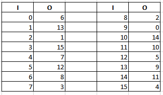

This here is just an example. For every value, we have a map to see which will be the output. 
- Normally, S-boxes are hard to design and not easy. We should be careful for certain things. e.g. If 0 maps to 6, 6 shouldn't map to 0.

---

# Substitution

Let's say that we put 12. 
- By checking the table, we can see that the output is going to be 5, $0101$.

---

# Permutation

However, this is not much different from the others. We want to add a permutation box too.
- Very simply, a permutation box shuffles the bits. It changes the order.
  - Draw an example.

---

# S and P combined

Drawing!

---

# Adding a key

What we've done up to this point is actually meaningless.
- Remember that in cryptography, everything is known. S and P boxes are known to others!
- We need something _secret_. That is the **key**.
- Now, we add a key to the system so that it becomes secure. 
  
Let's say we have 3 rounds (Drawing)
- For each round, we will XOR a $k_i$! This is called **key mixing**.
- $k_i$ will come from a **key schedule**.
  - We will expand our key and divide it into some parts so that we use a different $k_i$.

---

# Summary

- Even if we know S and P boxes, unless we know the **key** we cannot break the system.
  - Of course, it is not that easy. S and P boxes should be designed very carefully, the number of rounds is also important.
- This is an example of an SP network.
- It is the basis of the **AES** which is the encryption standard we use in almost everywhere.

---

# Back to AES

We think in terms of a **grid**.
- Remember that AES is a _SP Network_ not a _Feistel Network_.
  - In Feistel, we were using _half_ of the block.
  - In AES, we are using the **whole** block.
- We think in terms of a 4x4 grid. 128 bit is 16 bytes, so every box represents a byte!
- Let's draw it!

---

# AES

There are 4 steps in AES encryption: (In the first round, we apply $addRoundKey$ with initial round key.)
    - subBytes
    - shiftRows
    - mixColumns
    - AddRoundKey

In the last round, we are not going to do $mixColumns$ because it doesn't help us.
- The round key we add in every round is _different_. For that we are going to do **key expansion** (key schedule).

---

# AES

The number of rounds in AES depends on the _key length_.
- For 128 bits key, we have 10 rounds.
- For 192 bits key, we have 12 rounds.
- For 256 bits key, we have 14 rounds.

---

# subBytes

In the grid, we replace $b_0$ with $s(b_0)$. We write the value in the S-box.
- The S-box is designed very carefully. Every byte changes and it's very mixed up.
- It is just a lookup table, so it is fast.

---

# subBytes

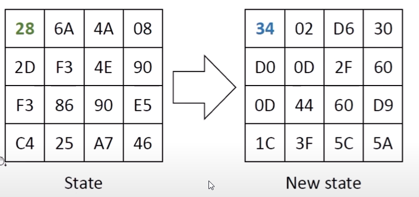
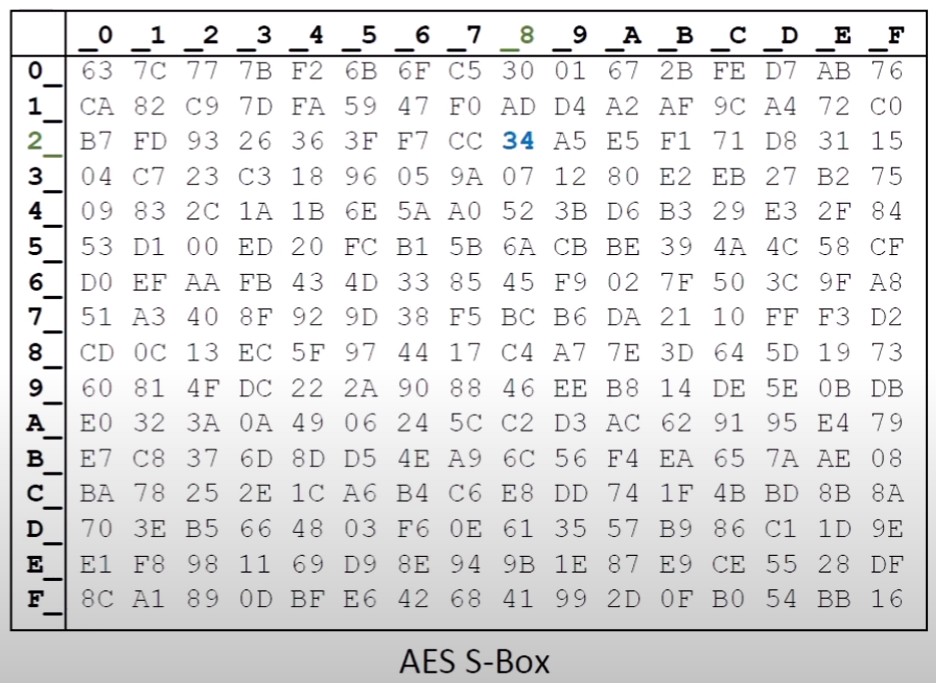

---

# shiftRows

* Remember that we do everything in _grid_.
* We are going to shift each row according to the row number.
  * First row shifts 0 places.
  * Second row shifts 1.
  * Third row shifts 2.
  * Last row shifts 3.

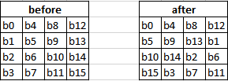

---

# mixColumns

In AES, operations are mathematical operations on finite fields. AES works on $GF(2^8)$. That means every element in this field is a **byte**. It starts from $00000000$ to $11111111$. 
- There are defined operations in this field and when they are applied, the result is always in this field.
  - You cannot get overflow or underflow. Every outcome is in this field.

That is why, we are not going to get into the detail of how $mixColumns$ work.
- We do matrix multiplication with a _known_ matrix.

---

# mixColumns cont.

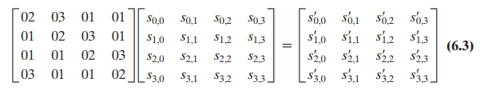

---

# addRoundKey

We XOR the output of $mixColumns$ with a **round key**. 
- For that, we need to know about the _key expansion_ method AES uses.
- It is called **key schedule**.

---

# AES Key Expansion

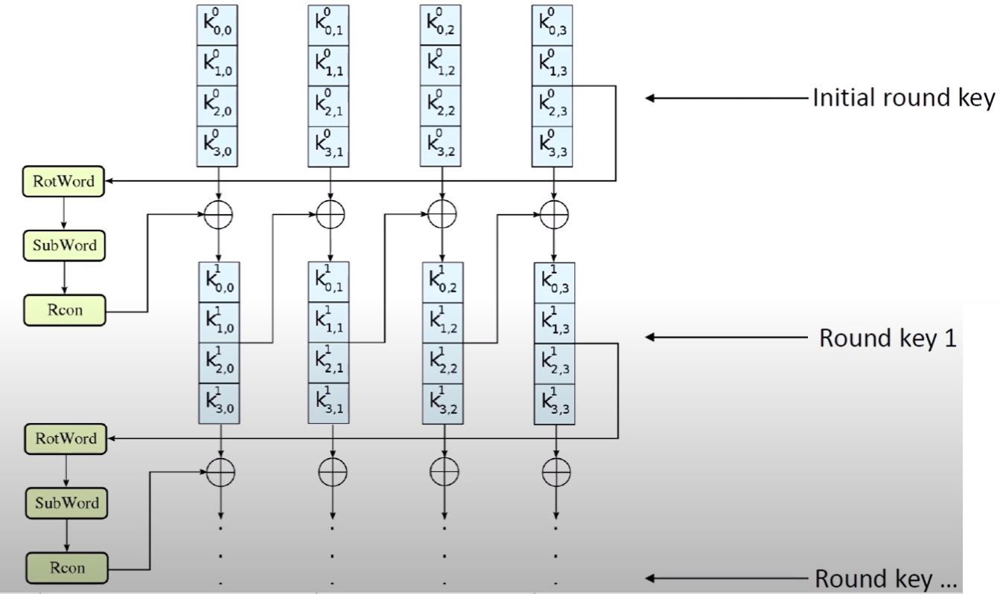

---

# Key exp -> Rotword

- Rotates a 32-bit word.
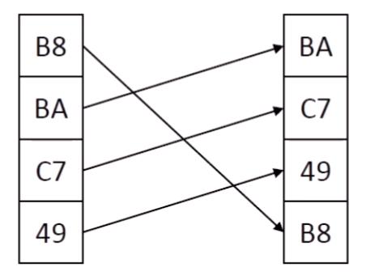

---

# Key exp --> Subword

This part substitutes a 32-bit word using AES S-box. The one we have seen before.
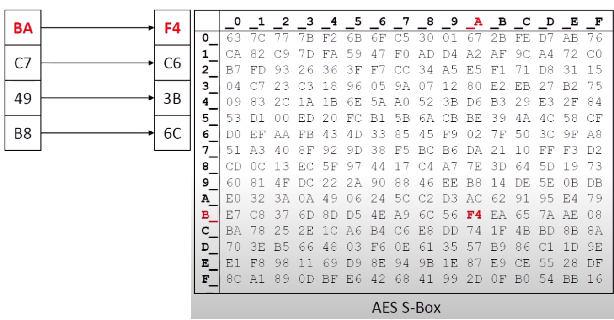

---

# Key exp --> Rcon

This is generated by using a recursive function. However, we already know what they are.
- Nonetheless, let's define.
- $rc(1) = 1$
- if $rc(i-1) < 0x80$
  - $rc(i) = 2.rc(i-1)$
- if $rc(i-1) >= 0x80$.
  - $rc(i) = (2.rc(i-1))$ xor $0x11B$ 

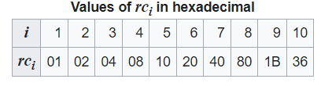
- This can be seen as a vector. These results are the first value, others are 00.

---

# Key exp end.

We shall look at the big picture to see how we will generate the key now.
- Since we know the _round number_ we know which $Rcon$ vector we will use.
- We will just follow the image and we will see what our next round key is.

